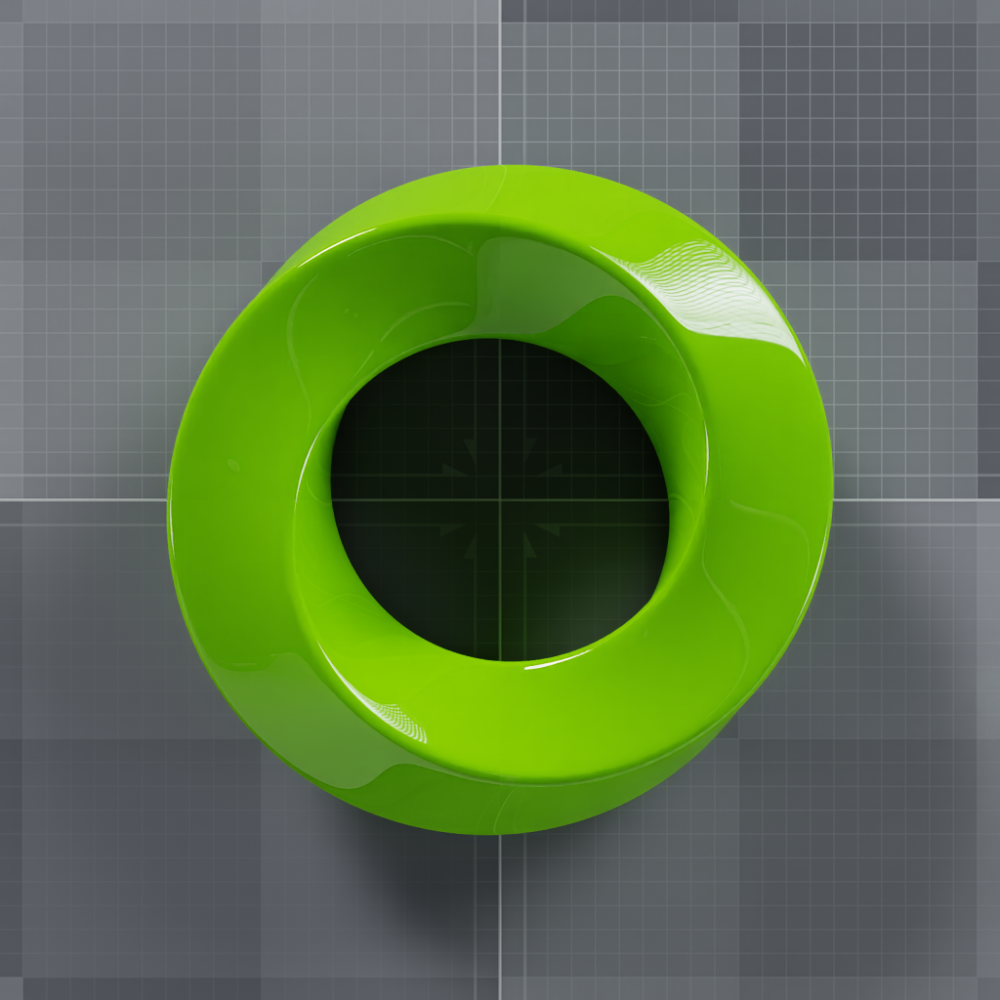

.. SPDX-FileCopyrightText: Copyright (c) 2026 NVIDIA CORPORATION & AFFILIATES. All rights reserved.
.. SPDX-License-Identifier: LicenseRef-NvidiaProprietary
..
.. NVIDIA CORPORATION, its affiliates and licensors retain all intellectual
.. property and proprietary rights in and to this material, related
.. documentation and any modifications thereto. Any use, reproduction,
.. disclosure or distribution of this material and related documentation
.. without an express license agreement from NVIDIA CORPORATION is strictly prohibited.

Python: Sliced Rendering
========================

Renders one 1024×1024 RenderProduct as four successive 512×512
``dataWindowNDC`` crops. The example warms up each crop for 10 frames, captures
the next ``LdrColor`` output, and stitches the TL, TR, BL, and BR tiles into one
RGBA image.

.. pull-quote::

   *“Render one image as four successive dataWindowNDC crops, warm up each crop, and stitch the captured TL, TR, BL, and BR tiles into a full-resolution image.”*

The tested crop-update and stitching pattern is:

.. literalinclude:: ../../tests/docs/python/test_base.py
   :language: python
   :start-after: # [snippet:doc-sliced-rendering]
   :end-before: # [/snippet:doc-sliced-rendering]
   :dedent:

Prerequisites
-------------

- Python 3.10-3.13
- `uv <https://docs.astral.sh/uv/>`_
- An NVIDIA RTX-capable GPU and a supported driver

Running
-------

.. code-block:: bash

   cd examples/python/sliced-rendering
   uv run main.py

Pass ``--png`` to save ``_output/render.png`` instead of displaying the image.
