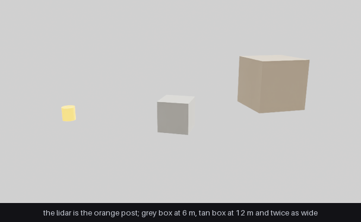
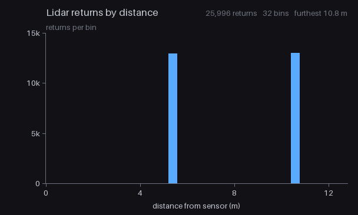

.. SPDX-FileCopyrightText: Copyright (c) 2026 NVIDIA CORPORATION & AFFILIATES. All rights reserved.
.. SPDX-License-Identifier: LicenseRef-NvidiaProprietary
..
.. NVIDIA CORPORATION, its affiliates and licensors retain all intellectual
.. property and proprietary rights in and to this material, related
.. documentation and any modifications thereto. Any use, reproduction,
.. disclosure or distribution of this material and related documentation
.. without an express license agreement from NVIDIA CORPORATION or
.. its affiliates is strictly prohibited.

Python: SPG Composite AOV
=========================

An SPG node whose input is a lidar rather than a camera. A lidar ``PointCloud`` is a
**composite AOV**: several named channels published together under one render var, instead of
the single image a camera AOV gives you. This node reads the ``Coordinates`` and ``Counts``
channels, counts the sweep's returns by distance, and publishes a bar chart on its own AOV.

The scene the sensor sweeps, from a second render product with an ordinary camera. The orange
post is the lidar; the grey box is 6 m away and the tan box 12 m away and twice as wide:

What the node made of that sweep, one bar per box:

The chart is two bars, one per box in the scene, because the scene contains nothing else the
sensor can reach. ``main.py`` then rebuilds the same histogram on the host from the same
channels and compares it bar by bar, so the example checks itself rather than being read by
eye.

Prerequisites
-------------

- Python 3.10-3.13
- `uv <https://docs.astral.sh/uv/>`_
- An NVIDIA RTX-capable GPU and a supported driver

Running
-------

.. code-block:: bash

   uv run main.py                                # CUDA
   uv run main.py --scene lidar_scene_slang.usda # Slang

One ``renderer.step()`` fills two render products: the lidar and its histogram, and an
ordinary camera view of the same scene. See :doc:`../spg/do/composites` for what a composite AOV is and how the channels are
bound.
