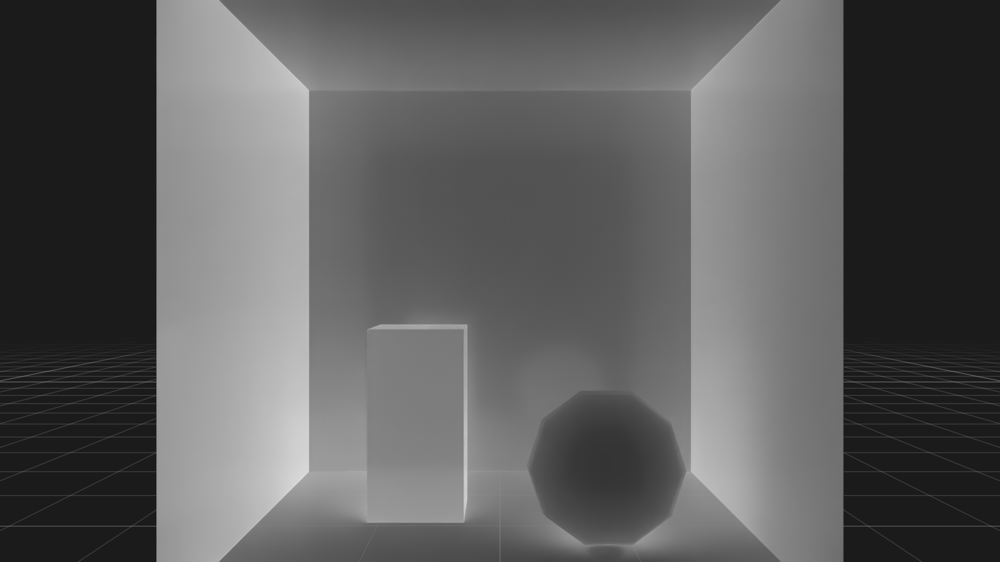

.. SPDX-FileCopyrightText: Copyright (c) 2026 NVIDIA CORPORATION & AFFILIATES. All rights reserved.
.. SPDX-License-Identifier: LicenseRef-NvidiaProprietary
..
.. NVIDIA CORPORATION, its affiliates and licensors retain all intellectual
.. property and proprietary rights in and to this material, related
.. documentation and any modifications thereto. Any use, reproduction,
.. disclosure or distribution of this material and related documentation
.. without an express license agreement from NVIDIA CORPORATION or
.. its affiliates is strictly prohibited.

Python: SPG Pipeline
====================

Two SPG shaders chained into a pipeline: ``LdrColor`` → grayscale → invert → ``LdrInverted``.
Shaders are chained by connecting one shader's output directly to the next shader's input, so the
intermediate grayscale result stays internal to the chain and only the final image is published
as an AOV. SPG runs the shaders in topological order of the connection graph.

.. pull-quote::

   *“Chain two SPG shaders so the renderer's color output is converted to grayscale and then inverted in a single RenderProduct, reading back only the final result.”*

Prerequisites
-------------

- Python 3.10-3.13
- `uv <https://docs.astral.sh/uv/>`_
- An NVIDIA RTX-capable GPU and a supported driver

Running
-------

.. code-block:: bash

   uv run main.py

The first step compiles both CUDA kernels with NVRTC. A successful run writes
``_output/input.png`` and ``_output/inverted_grayscale.png``.

The intermediate grayscale image is never published, so the run recomputes it from the input with
the kernel's own weights; inverting that at full strength is exactly ``255 - grey``. Grey but not
inverted means the second node did not run, and inverted but still coloured means the first did
not. See :doc:`../spg/overview` for the chaining and intermediate-AOV patterns.
