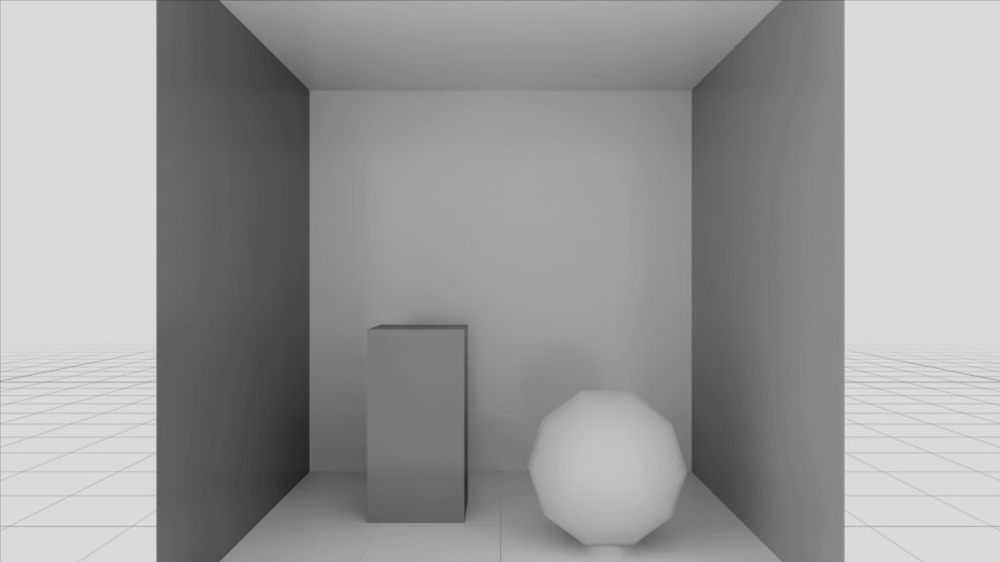

.. SPDX-FileCopyrightText: Copyright (c) 2026 NVIDIA CORPORATION & AFFILIATES. All rights reserved.
.. SPDX-License-Identifier: LicenseRef-NvidiaProprietary
..
.. NVIDIA CORPORATION, its affiliates and licensors retain all intellectual
.. property and proprietary rights in and to this material, related
.. documentation and any modifications thereto. Any use, reproduction,
.. disclosure or distribution of this material and related documentation
.. without an express license agreement from NVIDIA CORPORATION or
.. its affiliates is strictly prohibited.

Your First Node
===============

We are going to take the image the renderer produces, convert it to grayscale on the GPU, and
publish the result as a new AOV of our own. This is what we will have at the end:

That takes three files and a scene to wire them into, written in that order, in CUDA. Being able
to write a CUDA kernel and read USD is assumed; neither is taught here.

.. note::

   The complete runnable project, with ``main.py`` and ``uv run main.py``, is
   :doc:`../examples/python_spg_grayscale`.

.. note::
   This first node uses CUDA to keep the workflow focused. You can also build the same
   example with Slang by changing the GPU source and Lua launch script.

Step 1: The Kernel
------------------

**File:** ``GrayscaleKernel.cu``

SPG compiles this at runtime with NVRTC.

.. literalinclude:: ../../examples/python/spg-grayscale/GrayscaleKernel.cu
   :language: c
   :start-after: // [snippet:grayscale-kernel-template]
   :end-before: // [/snippet:grayscale-kernel-template]

Three things in there are not free choices:

- The entry point is ``extern "C"``. Without C linkage SPG cannot find it by name.
- ``uchar4`` matches the ``LdrColor`` AOV, which is RGBA uint8.
- The name ``grayscale`` is the first of three places it has to appear. We will write the other
  two in the next two steps.

Step 2: The Lua Launch Script
-----------------------------

**File:** ``GrayscaleKernel.cu.lua``

The script says how the kernel is launched. It receives an ``inputs`` table holding a
descriptor for each resource bound to the node, fills an ``outputs`` table with what the
node's outputs have to be, and returns the launch configuration. Its full surface is
:doc:`ref/lua_contract`.

The function name is the second of the three places that name has to appear.

.. literalinclude:: ../../examples/python/spg-grayscale/GrayscaleKernel.cu.lua
   :language: lua
   :start-after: -- [snippet:grayscale-launch-template]
   :end-before: -- [/snippet:grayscale-launch-template]

Again, what is not a free choice:

- The keys ``"LdrColor"`` and ``"LdrGrayscale"`` are the USD attribute names, which we author in
  the next step. They have to match exactly.
- The ``args`` list has to match the kernel's parameter list, in order and in type. The inline
  comments name the C parameter each entry feeds.
- ``shape[1]`` is height and ``shape[2]`` is width, while ``cuda.image`` takes width first. Swap
  that pair and the picture comes out transposed.
- ``cuda.uchar4`` is a **dtype**: it says what one element of the resource is, here four unsigned
  8-bit numbers, so one RGBA pixel. Dtypes are values taken from the ``cuda`` table and handed to
  the functions that create resources. The input's own dtype is readable as
  ``inputs["LdrColor"].dtype``, which is how a script checks what it was given. Refer to
  :ref:`Shapes and Types <spg-shapes-and-types>`.

Step 3: The USD Shader Definition
---------------------------------

**File:** ``GrayscaleKernel.usda``

This declares the node's interface and points SPG at the source file.

.. literalinclude:: ../../examples/python/spg-grayscale/GrayscaleKernel.usda
   :language: usda
   :start-after: # [snippet:shader-definition-template]
   :end-before: # [/snippet:shader-definition-template]

Four things to get right here:

- ``info:spg:sourceAsset`` is the path to the ``.cu`` file, relative to this ``.usda``. Its
  extension is what tells SPG how to treat it.
- ``info:spg:sourceAsset:subIdentifier`` is the third and last place the name ``grayscale``
  appears.
- ``opaque inputs:LdrColor`` and ``opaque outputs:LdrGrayscale`` are the names the launch script
  keyed on in the previous step.
- SPG finds the launch script by appending ``.lua`` to the source asset path, which is why the two
  files are named as they are. Refer to :doc:`ref/lua_contract`.

Nothing here names a scene. This file is a definition, and the scene we write next references it.

Step 4: The Scene File
----------------------

**File:** ``grayscale_scene.usda``

This is where the node joins the render. The rendering section of the scene follows; the rest of
the file is Cornell Box-inspired geometry, walls, a box and a sphere, which the renderer draws and
our node then transforms.

.. literalinclude:: ../../examples/python/spg-grayscale/grayscale_scene.usda
   :language: usda
   :start-after: # [snippet:render-graph]
   :end-before: # [/snippet:render-graph]

Follow the wiring in one direction and it reads as a chain:

.. code-block:: text

    LdrColor.omni:rtx:aov  ->  GrayscaleKernel.inputs:LdrColor
    GrayscaleKernel.outputs:LdrGrayscale  ->  LdrGrayscale.omni:rtx:aov.connect

Both RenderVars carry a ``sourceName``, which is the name the AOV is registered under, and both
are listed in ``orderedVars``. Leave either out and the node has nothing to read or nowhere to
publish.

.. _spg-grayscale-run-it:

Step 5: Run It
--------------

Loaded, the scene renders as ``LdrColor`` through its camera. This is what our node is about to
be handed:

.. image:: images/grayscale-scene-loaded.png
   :alt: The loaded scene

The first step compiles the node and can take up to a minute on a cold shader cache, so warm
up before reading anything back. Attach a stage, load the scene, and step the product:

.. literalinclude:: ../../examples/python/spg-grayscale/main.py
   :language: python
   :start-after: # [snippet:spg-create-renderer]
   :end-before: # [/snippet:spg-create-renderer]
   :dedent: 4

.. literalinclude:: ../../examples/python/spg-grayscale/main.py
   :language: python
   :start-after: # [snippet:spg-open-scene]
   :end-before: # [/snippet:spg-open-scene]
   :dedent: 4

.. literalinclude:: ../../examples/python/spg-grayscale/main.py
   :language: python
   :start-after: # [snippet:spg-warmup-and-step]
   :end-before: # [/snippet:spg-warmup-and-step]
   :dedent: 4

The graph runs on every step. Read ``LdrGrayscale`` back the same way as any built-in render
var, then release in the reverse order of setup:

.. filtered-literalinclude:: ../../examples/python/spg-grayscale/main.py
   :language: python
   :start-after: # [snippet:spg-read-output-aov]
   :end-before: # [/snippet:spg-read-output-aov]
   :omit-markers:
   :dedent: 4

Read back, ``LdrGrayscale`` is the same image with the colour taken out of it:

An output AOV is read back the same way whatever it holds: map it to the CPU, or to CUDA with
``ovrtx.Device.CUDA``, and copy it out.

That is a working SPG node. It runs inside the renderer's own frame, reads an AOV the renderer
produced, and publishes one of its own that anything downstream reads without knowing SPG was
involved. Nothing was compiled into the renderer to make that happen.

What Next
---------

The pages under :doc:`How-To <do/index>` cover common SPG tasks.
