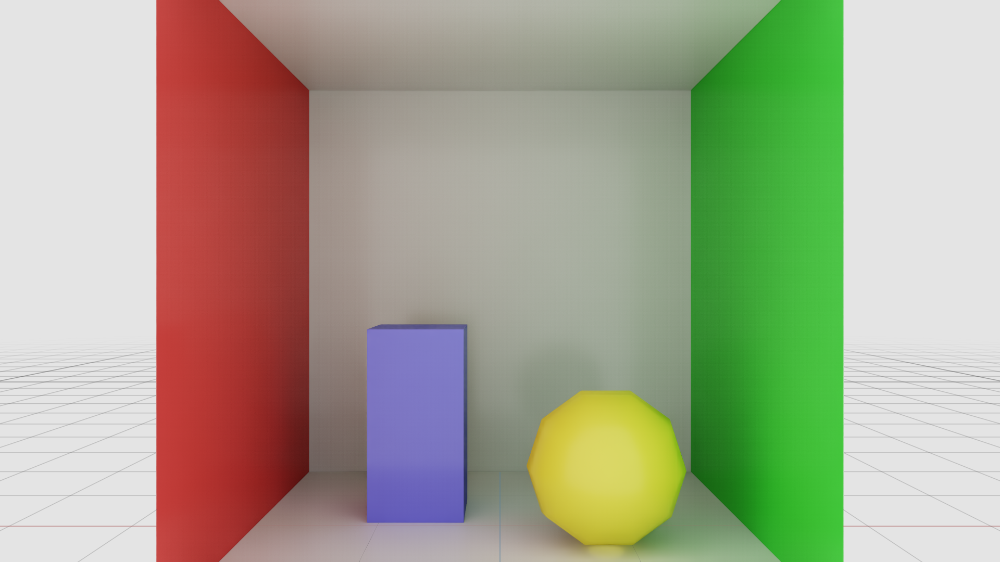
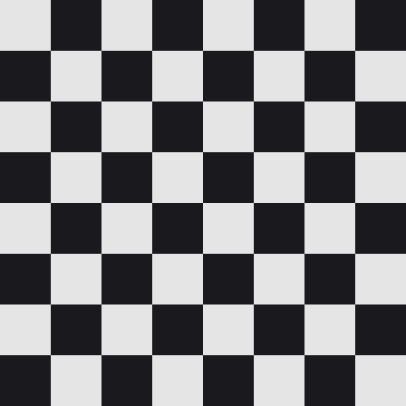
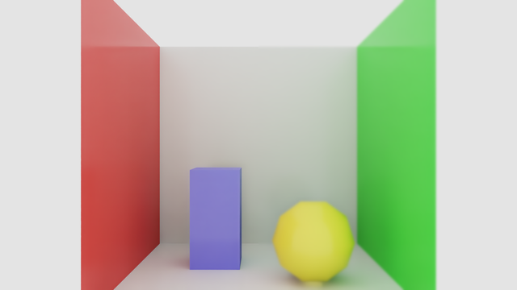

# ovrtx Examples

This directory contains example projects demonstrating various features of ovrtx.

## Example Projects

<table>
  <tr>
    <td align="center" width="50%">
      
       
      <b>Minimal</b>
       
      <blockquote>
        
<em>“Create the smallest useful ovrtx example that loads an existing USD scene, renders one camera frame, maps the color output, and saves or displays the result while cleaning up resources appropriately.”</em>

      </blockquote>
      Build &amp; run in: <a href="c/minimal/">C →</a>, <a href="python/minimal/">Python →</a>
    </td>
    <td align="center" width="50%">
      
       
      <b>Status Queries</b>
       
      <blockquote>
        
<em>“Create a rendering example that demonstrates operation status queries, including logging, asynchronous scene loading, progress and counter polling while waiting, shader warmup feedback, final frame rendering, output handling, and error checks.”</em>

      </blockquote>
      Build &amp; run in: <a href="c/status-queries/">C →</a>, <a href="python/status-queries/">Python →</a>
    </td>
  </tr>
  <tr>
    <td align="center" width="50%">
      
       
      <b>Vulkan Interop</b>
       
      <blockquote>
        
<em>“Create a C++ interactive viewer that renders ovrtx camera output directly into a Vulkan presentation path through CUDA interop, with GPU selection, GPU image mapping, exported-image copies, explicit synchronization, double buffering, orbit camera controls, finite-frame capture, and click or marquee picking with selection outlines.”</em>

      </blockquote>
      Build &amp; run in: <a href="c/vulkan-interop/">C →</a>
    </td>
    <td align="center" width="50%">
      
       
      <b>Planet System</b>
       
      <blockquote>
        
<em>“Create an animation example that loads a base scene, injects generated runtime geometry, creates persistent transform bindings, updates many transforms efficiently each simulation step using CPU or GPU compute, renders frames, optionally streams or saves them, and cleans up bindings explicitly.”</em>

      </blockquote>
      Build &amp; run in: <a href="python/planet-system/">Python →</a>
    </td>
  </tr>
  <tr>
    <td align="center" width="50%">
      
       
      <b>Tiled Rendering</b>
       
      <blockquote>
        
<em>“Create an example that composes multiple referenced scene instances into a grid, assigns per-instance visual variation at runtime, renders all cameras through one tiled output, warms up for image quality, and saves or displays the final tiled image.”</em>

      </blockquote>
      Build &amp; run in: <a href="python/tiled-rendering/">Python →</a>
    </td>
    <td align="center" width="50%">
      
       
      <b>Semantic Segmentation</b>
       
      <blockquote>
        
<em>“Create an example that composes an existing scene with semantic label overrides and camera annotation outputs, renders several camera AOVs including semantic segmentation and its ID map, decodes metadata into human-readable labels, logs a useful visual layout to a viewer, and supports headless image export.”</em>

      </blockquote>
      Build &amp; run in: <a href="python/semantic-segmentation/">Python →</a>
    </td>
  </tr>
  <tr>
    <td align="center" width="50%">
      
       
      <b>Crop Window</b>
       
      <blockquote>
        
<em>“Create an example that renders a centered dataWindowNDC crop from a full-resolution RenderProduct, verifies the cropped output dimensions, and saves or displays the result.”</em>

      </blockquote>
      Build &amp; run in: <a href="python/crop-window/">Python →</a>
    </td>
    <td align="center" width="50%">
      
       
      <b>Sliced Rendering</b>
       
      <blockquote>
        
<em>“Render one image as four successive dataWindowNDC crops, warm up each crop, and stitch the captured TL, TR, BL, and BR tiles into a full-resolution image.”</em>

      </blockquote>
      Build &amp; run in: <a href="python/sliced-rendering/">Python →</a>
    </td>
  </tr>
  <tr>
    <td align="center" width="50%">
      
       
      <b>Lidar Sensor</b>
       
      <blockquote>
        
<em>“Create a lidar sensor example that applies required sensor runtime settings as needed, loads a configured lidar scene, warms up the sensor pipeline, renders one point-cloud output, reads valid point data safely through the count channel, prints summary statistics, and cleans up resources appropriately.”</em>

      </blockquote>
      Build &amp; run in: <a href="c/sensors/lidar/">C →</a>, <a href="python/sensors/lidar/">Python →</a>
    </td>
    <td align="center" width="50%">
      
       
      <b>Radar Sensor</b>
       
      <blockquote>
        
<em>“Create a radar sensor example that applies required runtime settings as needed, loads an animated radar scene, advances scene time across several simulation steps, reads valid detections including signal strength and signed radial velocity, prints per-step summaries, and cleans up resources appropriately.”</em>

      </blockquote>
      Build &amp; run in: <a href="c/sensors/radar/">C →</a>, <a href="python/sensors/radar/">Python →</a>
    </td>
  </tr>
  <tr>
    <td align="center" width="50%">
      
       
      <b>Material Editor</b>
       
      <blockquote>
        
<em>“Create a C++ Qt desktop application that combines live ovrtx rendering with read-only USD material introspection, showing materials, a rendered viewport, a shader graph, and editable shader properties, while keeping runtime material edits and rendering resets separate from introspection.”</em>

      </blockquote>
      Build &amp; run in: <a href="c/material-editor/">C →</a>
    </td>
    <td align="center" width="50%">
      
       
      <b>Projectors</b>
       
      <blockquote>
        
<em>“Create an example that loads an authored projector-mapping scene without editing it, warms up the renderer, renders one frame, and saves the result as a PNG.”</em>

      </blockquote>
      Build &amp; run in: <a href="python/projectors/">Python →</a>
    </td>
  </tr>
  <tr>
    <td align="center" width="50%">
      
       
      <b>SPG: Grayscale</b>
       
      <blockquote>
        
<em>“Create the smallest useful SPG example: a CUDA kernel that converts the LdrColor render output to grayscale, wired into a RenderProduct and read back from Python as a new AOV.”</em>

      </blockquote>
      Build &amp; run in: <a href="python/spg-grayscale/">Python →</a>
    </td>
    <td align="center" width="50%">
      
       
      <b>SPG: Pipeline</b>
       
      <blockquote>
        
<em>“Chain two SPG shaders so the renderer's color output is converted to grayscale and then inverted in a single RenderProduct, reading back only the final result.”</em>

      </blockquote>
      Build &amp; run in: <a href="python/spg-pipeline/">Python →</a>
    </td>
  </tr>
  <tr>
    <td align="center" width="50%">
      
       
      <b>SPG: Built-in Nodes</b>
       
      <blockquote>
        
<em>“Chain two built-in SPG nodes (no custom CUDA) that brighten the color output and downscale it to half resolution, wired into a RenderProduct via info:id.”</em>

      </blockquote>
      Build &amp; run in: <a href="python/spg-builtin-nodes/">Python →</a>
    </td>
    <td align="center" width="50%">
      
       
      <b>SPG: Stateful Node</b>
       
      <blockquote>
        
<em>“Make an SPG node read back its own previous output, so a moving object drags a fading trail behind it.”</em>

      </blockquote>
      Build &amp; run in: <a href="python/spg-stateful/">Python →</a>
    </td>
  </tr>
  <tr>
    <td align="center" width="50%">
      
       
      <b>SPG: Composite AOV</b>
       
      <blockquote>
        
<em>“Feed an SPG node from a lidar instead of a camera, reading the point cloud's named channels and publishing a histogram of returns by distance.”</em>

      </blockquote>
      Build &amp; run in: <a href="python/spg-composite-aov/">Python →</a>
    </td>
    <td align="center" width="50%">
      
       
      <b>SPG: Ray Generation</b>
       
      <blockquote>
        
<em>“Have an SPG node trace the scene itself: a Cornell box with ray-traced shadows and the geometric normal recovered from probe rays alone.”</em>

      </blockquote>
      Build &amp; run in: <a href="python/spg-raygen/">Python →</a>
    </td>
  </tr>
  <tr>
    <td align="center" width="50%">
      
       
      <b>SPG: Generating Node</b>
       
      <blockquote>
        
<em>“Write an SPG node with no input AOV that draws a checkerboard from typed USD attributes, and publish it as a render output.”</em>

      </blockquote>
      Build &amp; run in: <a href="python/spg-generate/">Python →</a>
    </td>
    <td align="center" width="50%">
      
       
      <b>SPG: Separable Blur</b>
       
      <blockquote>
        
<em>“Chain two SPG nodes into a separable blur whose tap weights are built once in the launch script, and retune the radius from the host between renders.”</em>

      </blockquote>
      Build &amp; run in: <a href="python/spg-blur/">Python →</a>
    </td>
  </tr>
  <tr>
    <td align="center" width="50%">
      
       
      <b>SPG: Previous Frame</b>
       
      <blockquote>
        
<em>“Have an SPG node read the same AOV twice, once live and once a frame back, and publish the difference so only what moved lights up.”</em>

      </blockquote>
      Build &amp; run in: <a href="python/spg-previous-frame/">Python →</a>
    </td>
  </tr>
</table>
