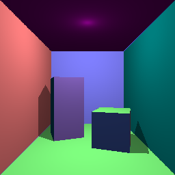

# SPG Ray Generation Example

An SPG node that **traces the scene itself** instead of post-processing an AOV. One primary ray
per pixel through the render product's camera, a shadow ray toward the light, and the exact
geometric normal of every surface recovered from two extra probe rays.



The whole image is produced by the node. Nothing here is a renderer AOV.

## What the colours mean

Surface colour is the **recovered surface normal**, encoded to 0..1 and modulated by the
lighting. So each face's hue states its orientation:

| Surface | Normal | Reads |
|---------|--------|-------|
| Floor | +Y | green-dominant |
| Ceiling | -Y | green-minimal |
| Left wall | +X | red-dominant |
| Right wall | -X | red-minimal |
| Back wall | +Z | blue-dominant |

The two blocks are ordinary solid six-sided meshes, rotated about Y, so their faces are *not*
axis aligned and each still resolves to its own correct normal.

## What a raygen node gets for free

A shader living under a RenderProduct receives two things with no authored input and no
connection in the scene:

- the **scene acceleration structure**, bound with `slang.binding("scene", inputs["scene"])`
- the **camera-to-trace-space transform** of that product's camera, plus its unit factors, as
  the value-inputs `sceneTransform` and `sceneRenderScaleFactor`

That is why the shader can author rays in ordinary camera space, looking down -Z, without
knowing where the camera is in the world.

## Recovering the normal without geometry buffers

No vertex data is exposed to the shader, so the normal is derived from the trace itself. A
triangle is flat, so three points on it define its plane. The primary ray gives one point and
the surface's identity; two probe rays fired parallel to it, offset sideways, give two more.
The cross product of the two edge vectors is the exact geometric normal.

It costs three rays per shaded hit plus one shadow ray, and it is re-derived every frame, so it
works on moving and tessellated geometry alike.

| File | Role |
|------|------|
| `RaygenCornellBox.slang` | The ray-generation shader: camera rays, normal recovery, shadow ray, shading. |
| `RaygenCornellBox.slang.lua` | Allocates the image and binds the scene; the output shape drives the ray dispatch. |
| `RaygenCornellBox.slang.usda` | Shader definition: the shading parameters and the image output. |
| `cornell_box_scene.usda` | The room, the two blocks, the camera and the render graph. |

## Prerequisites

- Python 3.10-3.13
- [uv](https://docs.astral.sh/uv/)
- NVIDIA RTX-capable GPU
- Supported NVIDIA driver
- Unsandboxed runtime execution

Slang nodes require the renderer to run on the Vulkan backend, which is the default.

## Running

```bash
uv run main.py                                          # inline RayQuery
uv run main.py --scene cornell_box_pipeline_scene.usda  # ray-tracing pipeline
```

The same room is traced two ways. `RaygenCornellBox.slang` drives an inline `RayQuery` from the
ray-generation shader. `RaygenCornellBoxPipeline.slang` drives a ray-tracing pipeline instead, so
the traversal result comes back through a payload written by separate `miss` and `closesthit`
entry points. The two shaders are otherwise the same file: identical shading, identical normal
recovery from probe rays, identical shadow test.

Both runs print the same checks. The two images agree on 99.85% of pixels; 101 of 65536 differ,
deterministically, so each form reproduces its own image exactly on a rerun.

```
rays that escaped the room: 0
  ok   floor +Y reads green-dominant
  ok   ceiling -Y reads green-minimal
  ok   left wall +X reads red-dominant
  ok   right wall -X reads red-minimal
  ok   back wall +Z reads blue-dominant
surfaces more than 4 degrees off every axis: 11.8%
shadowed 3.8% of pixels, lit 96.2%
```

`main.py` checks the render with no golden image. The hue ordering survives any lighting level,
so it is immune to brightness but fails on a wrong or flipped normal. The off-axis population is
what proves the per-triangle recovery works on the rotated blocks rather than only on flat
walls; it compares the colours as written rather than decoding them, because the shader scales
the encoded normal by the lighting and decoding would turn a shadowed wall into a tilted one.
Alpha carries visibility, so shadowing is checked independently of colour.

## Limitations

Direct lighting only. There is no global illumination, so none of the colour bleeding a
physically lit Cornell box shows; the colours are surface normals, not materials.
